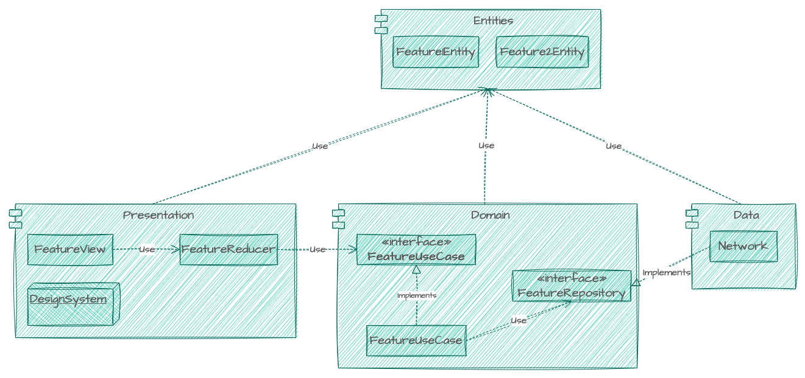

# MyAlbum

This project is a small photo album application which fetch Album and Photos from Api Below:

1. [Album](https://jsonplaceholder.typicode.com/albums)
2. [Photos](https://jsonplaceholder.typicode.com/photos)

# Approach

1. Chose `SwiftUI` To develop the UI faster.
2. Chose `TCA(Composabl-Architecture)`, to get the most out of SwiftUI state-managment and not struggle with handling different states with properties of an ObservableObject.
3. Used `Dependencies` to handle dependency managment as it has great adaptibility with TCA and great tools for testing.
4. Followed TDD to write several Unit Tests for Reducer and UseCases, and UITest.

# UI Senarios

## Album List
User can:

1. See a list of Albums with the first photo of that album's image as a thumbnail.
2. Filter Albums By userId from context menu on top-navigation-bar and clicking on UserIDs sub menu.
3. Change the list style to sectioned byUserIds.
4. Tap on each Album to be navigated to Photos of that album.

## Photos List

User can:

1. See a list of Photos(thumbnail) With its titles.
2. Tap on each row to see the high quality image instead, and tap again to hide.
3. Navigate back to album list.

# Architecture & Tools

- [x] Deployment target: iOS 16.4
- [x] Devices: iPhone, iPad, macOS(Designed for iPad)
- [x] Redux(Presentation) + Clean
- [x] Language: Swift 5
- [x] SwiftUI
- [x] Composable-Architecture

## Features and Bonuses

- [x] The ability to filter Albums by userId.
- [x] An album has a random cover image from the photos within it.
- [x] When browsing an album and clicking on an image thumbnail (photos.thumbnailUrl), the user can view the larger version of the image (photos.url).
- [x] Image `Caching`(with memory and disk threshold).
- [x] Used `Lazy` List to render views only when visible.
- [x] Prevent rerendering Views if not changed.
- [x] Design System(reusable compnnents and Modifiers to reduce code duplications).
- [x] Unit and UI `Tests`.
- [x] Dependency Managment.
- [x] Self Implemented Network Layer.
- [x] Fancy Animations and Transitions.
- [x] Avoided Complexity.
- [x] Used `DTO` and DTO Mapping.
- [x] Layers Depend on Abstraction/Interfaces(Scalability).

# Building At Scale

1. Better Dependency Management tools or solution to handle modular architecture.
2. Improve DesignSystem and UX.
3. Integrate a Repository Layer to cache image indenpendently from Network Layer.
4. Use Feature Module.
5. Use Project Generator(Tuist) to avoid complex conflict(xproj) and handle extensions and static configuration more conveniently.
6. Use Dynamic Page Routing.

# Diagram

